# Flux Utility Solutions

**Reference Architecture for Utilities on Snowflake**

A comprehensive solution accelerator demonstrating how utility companies can leverage Snowflake's AI Data Cloud for grid operations, customer analytics, and predictive maintenance.

[](https://www.snowflake.com)
[](LICENSE)

---

## What is Flux?

Flux Utility Solutions provides a **production-ready reference architecture** for electric utilities, featuring:

- **Grid Operations** - Real-time monitoring, outage management, restoration tracking
- **Customer Analytics** - 360-degree customer views, consumption analysis, billing insights  
- **Asset Management** - Transformer health monitoring, predictive maintenance, risk scoring
- **AI-Powered Insights** - Natural language queries, intelligent search, conversational agents

> **One solution, five deployment paths.** Whether your team prefers SQL scripts, interactive notebooks, GitOps workflows, CLI automation, or Terraform - Flux has you covered.

---

## Quick Start

Get a working environment in under 2 minutes:

```bash
# 1. Clone the repository
git clone https://github.com/Snowflake-Labs/flux-utility-solutions.git
cd flux-utility-solutions

# 2. Ensure Snow CLI is installed and configured
snow connection list

# 3. Run quick start
./cli/quickstart.sh

# Or specify your own database/connection:
./cli/quickstart.sh --database MY_DB --connection my_connection
```

**What gets deployed:**
- Database with PRODUCTION, APPLICATIONS, SECRETS schemas
- Warehouse (XSMALL, auto-suspend 60s)
- Core tables: Substations, Transformers, Meters, Customers
- Sample seed data loaded and ready to query

---

## Architecture

```mermaid
flowchart LR
    subgraph APP["APPLICATION LAYER"]
        A1["Streamlit Apps"]
        A2["Cortex Agents"]
        A3["Notebooks"]
        A4["SPCS Services"]
    end
    
    subgraph ANALYTICS["ANALYTICS LAYER"]
        B1["Dynamic Tables"]
        B2["Cortex Analyst"]
        B3["Cortex Search"]
        B4["ML Models"]
    end
    
    subgraph DATA["DATA LAYER"]
        C1["AMI Readings"]
        C2["Grid Topology"]
        C3["Customers"]
        C4["Asset Metadata"]
    end
    
    APP --> ANALYTICS --> DATA
    
    style APP fill:#1565c0,color:#fff,stroke:#0d47a1
    style ANALYTICS fill:#ef6c00,color:#fff,stroke:#e65100
    style DATA fill:#2e7d32,color:#fff,stroke:#1b5e20
```



See [ARCHITECTURE.md](./docs/ARCHITECTURE.md) for detailed diagrams and design decisions.

---

## Deployment Paths

Choose the deployment method that fits your team:

| Path | Best For | Time | Guide |
|------|----------|------|-------|
| **CLI Quick Start** | Quick demos, POCs | ~2 min | `./cli/quickstart.sh` |
| **SQL Scripts** | Learning, auditing, manual control | 15-30 min | [scripts/README.md](./scripts/README.md) |
| **Notebooks** | POC workshops, data scientists | 20 min | [notebooks/README.md](./notebooks/README.md) |
| **Git Integration** | Modern DevOps, GitOps workflows | 15 min | [git_deploy/README.md](./git_deploy/README.md) |
| **Terraform** | Enterprise IaC, multi-environment | 10 min | [terraform/README.md](./terraform/README.md) |

All paths deploy **identical infrastructure** - choose based on your preferences and workflow.

---

## Snowflake Capabilities

### Cortex AI
| Feature | Description |
|---------|-------------|
| **Cortex Analyst** | Natural language SQL with semantic models |
| **Cortex Search** | Vector search for customers, meters, documents |
| **Cortex Agent** | Multi-tool conversational AI assistant |

### Data Engineering
| Feature | Description |
|---------|-------------|
| **Dynamic Tables** | Declarative Bronze → Silver → Gold pipelines |
| **Streams & Tasks** | Real-time CDC and scheduled processing |
| **Stages** | Git integration and file management |

### Machine Learning
| Feature | Description |
|---------|-------------|
| **Snowpark ML** | XGBoost transformer risk prediction |
| **Model Registry** | Versioned models with governance |
| **Feature Store** | Centralized feature management |

### Applications
| Feature | Description |
|---------|-------------|
| **Streamlit** | Interactive dashboards and visualizations |
| **Notebooks** | Collaborative data exploration |
| **SPCS** | Containerized full-stack applications |

---

## Use Cases

| Use Case | Solution | Location |
|----------|----------|----------|
| **AMI Analytics** | Time-series analysis of smart meter data | `scripts/04_*`, `notebooks/demos/` |
| **Grid Visualization** | H3 hexagonal maps with PyDeck | `streamlit/geospatial/` |
| **Customer 360** | Unified customer view with search | `scripts/07_*` |
| **Predictive Maintenance** | ML-based transformer risk scoring | `scripts/08-09_*` |
| **Conversational Analytics** | Natural language grid intelligence | `agents/`, `models/` |
| **Outage Management** | Real-time tracking and restoration | `streamlit/outage_dashboard/` |

---

## Repository Structure

```
flux-utility-solutions/
├── cli/               # Quick start scripts
├── scripts/           # SQL deployment scripts (01-99)
├── notebooks/         # Snowflake Notebooks
├── git_deploy/        # Git integration (EXECUTE IMMEDIATE FROM)
├── terraform/         # Infrastructure as Code
│
├── streamlit/         # Streamlit in Snowflake apps
├── agents/            # Cortex Agent definitions
├── models/            # Cortex Analyst semantic models
│
├── seed_data/         # Sample data (CSV, Parquet)
├── generators/        # Synthetic data generation
├── spcs/              # Container services
│
└── docs/              # Documentation
```

---

## Sample Data

Get started immediately with bundled sample data:

| Dataset | Records | Description |
|---------|---------|-------------|
| Substations | 269 | Transmission/distribution infrastructure |
| Transformers | 100 | Asset specifications and health data |
| Meters | 100 | AMI smart meter metadata |
| Customers | 94 | Customer master records |

**Need more data?** Scale up with included generators:

```bash
# Generate larger datasets locally
python generators/generate_all.py --size full

# Or use SQL-based generation in Snowflake
snow sql -f scripts/51_generate_ami_sample.sql -D "days=30"
```

---

## Prerequisites

| Requirement | Purpose |
|-------------|---------|
| Snowflake account | ACCOUNTADMIN role recommended |
| [Snow CLI](https://docs.snowflake.com/en/developer-guide/snowflake-cli/index) | Script deployment and management |
| Python 3.10+ | Optional: data generators |
| Docker | Optional: SPCS deployment |
| Terraform 1.5+ | Optional: IaC deployment |

---

## Documentation

| Document | Description |
|----------|-------------|
| [ARCHITECTURE.md](./docs/ARCHITECTURE.md) | System architecture and design |
| [DATA_MODEL.md](./docs/DATA_MODEL.md) | Database schema documentation |
| [DEPLOYMENT.md](./docs/DEPLOYMENT.md) | Step-by-step deployment guide |
| [CORTEX_GUIDE.md](./docs/CORTEX_GUIDE.md) | AI features configuration |
| [TERRAFORM_GUIDE.md](./docs/TERRAFORM_GUIDE.md) | Infrastructure as Code guide |
| [SEED_DATA_GUIDE.md](./docs/SEED_DATA_GUIDE.md) | Loading sample data |

---

## Variable Templating

Different deployment paths use different variable syntax:

| Path | Syntax | Example |
|------|--------|---------|
| SQL Scripts (Snow CLI) | `<% var %>` | `CREATE DATABASE <% database %>` |
| Git Integration | `$var` + USING | `EXECUTE IMMEDIATE FROM ... USING (db => 'X')` |
| Terraform | `var.name` | `var.database_name` |

---

## License

Apache 2.0 - See [LICENSE](./LICENSE)

---

## Contributing

Contributions welcome! Please ensure all changes pass validation tests before submitting.

---

<p align="center">
  <strong>Built for Snowflake AI Data Cloud</strong>
</p>
