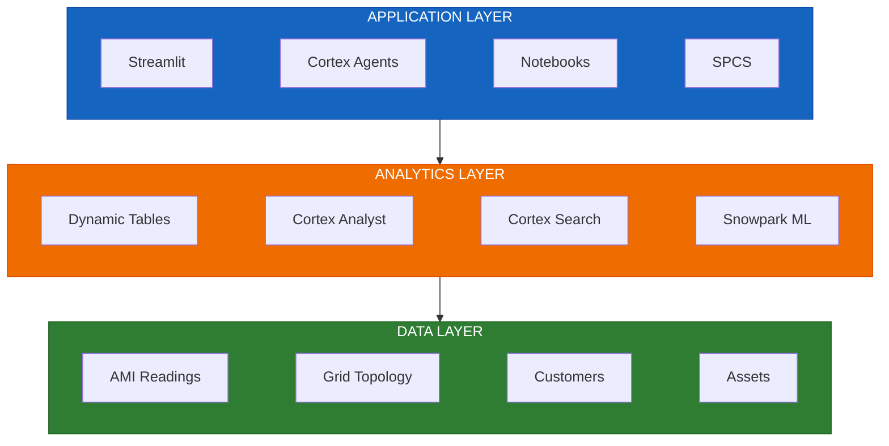
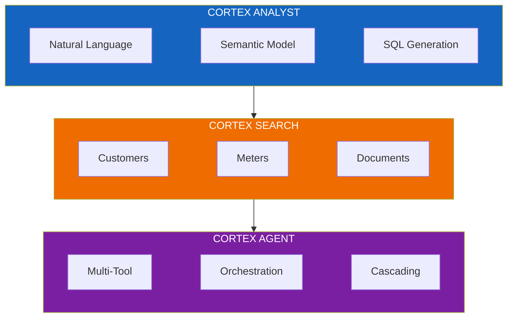
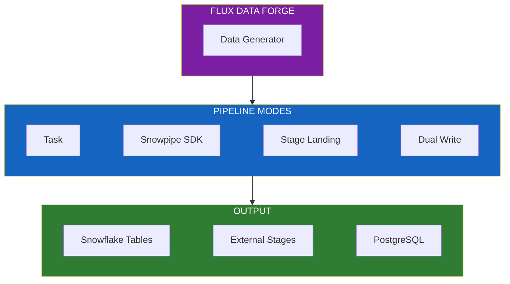

# Flux Utility Solutions

[](https://www.snowflake.com)
[](LICENSE)

**A reference architecture for electric utilities on Snowflake's AI Data Cloud.**

Transform grid operations with real-time monitoring, predictive maintenance, and AI-powered analytics - all running natively in Snowflake.

---

## Why Flux?

| Challenge | Flux Solution |
|-----------|---------------|
| Siloed AMI, GIS, and customer data | **Unified data platform** with single source of truth |
| Manual SQL for business questions | **Natural language queries** via Cortex Analyst |
| Reactive maintenance | **Predictive risk scoring** with Snowpark ML |
| Complex deployment requirements | **5 deployment paths** - choose your workflow |

> **One solution. Five deployment paths.** SQL scripts, notebooks, Git integration, CLI, or Terraform - Flux works the way your team works.

---

## Quick Start

Get a working demo environment in under 2 minutes:

```bash
# Clone and deploy
git clone https://github.com/Snowflake-Labs/flux-utility-solutions.git
cd flux-utility-solutions
./cli/quickstart.sh
```

**What you get:**
- Database with schemas (PRODUCTION, APPLICATIONS, SECRETS)
- Core tables: Substations, Circuits, Transformers, Meters, Customers
- Sample data loaded and ready to query
- Warehouse configured with auto-suspend

```bash
# Custom deployment
./cli/quickstart.sh --database MY_FLUX_DB --connection my_connection
```

---

## Architecture



### AI Capabilities



See [ARCHITECTURE.md](./docs/ARCHITECTURE.md) for detailed design documentation.

---

## Deployment Paths

Choose the method that fits your team:

| Path | Best For | Guide |
|------|----------|-------|
| **CLI Quick Start** | Demos, POCs, fastest setup | `./cli/quickstart.sh` |
| **SQL Scripts** | Learning, auditing, step-by-step control | [scripts/](./scripts/) |
| **Notebooks** | Workshops, data science teams | [notebooks/](./notebooks/) |
| **Git Integration** | GitOps, CI/CD pipelines | [git_deploy/](./git_deploy/) |
| **Terraform** | Enterprise IaC, multi-environment | [terraform/](./terraform/) |

All paths deploy **identical infrastructure**.

---

## Use Cases

| Use Case | What It Does | Location |
|----------|--------------|----------|
| **Grid Visualization** | H3 hexagonal maps with real-time topology | `streamlit/geospatial/` |
| **AMI Analytics** | Smart meter time-series analysis | `notebooks/demos/` |
| **Customer 360** | Unified customer view with semantic search | `scripts/07_*` |
| **Predictive Maintenance** | ML-based transformer risk scoring | `scripts/08-09_*` |
| **Conversational Analytics** | Natural language grid intelligence | `agents/` |
| **Outage Management** | Real-time tracking and restoration | `streamlit/outage_dashboard/` |

---

## Snowflake Features Used

| Category | Features |
|----------|----------|
| **Cortex AI** | Analyst, Search, Agent, LLM Functions |
| **Data Engineering** | Dynamic Tables, Streams, Tasks, Stages |
| **Machine Learning** | Snowpark ML, Model Registry, Feature Store |
| **Applications** | Streamlit, Notebooks, SPCS |

---

## Flux Data Forge

**Scale synthetic data from thousands to hundreds of millions of rows.**

Flux Data Forge is an SPCS application that generates realistic AMI data and demonstrates streaming pipeline patterns - without requiring production customer data.



| Capability | What It Does |
|------------|--------------|
| **Batch Generation** | Create 67K to 350M+ rows of AMI readings with realistic patterns |
| **Streaming Pipelines** | Demo 4 ingestion modes: Task, Snowpipe SDK, Stage Landing, Dual Write |
| **Production Matching** | Use real meter IDs from infrastructure tables |
| **Correlated Data** | Generate work orders, outages, power quality linked to meters |

**Use cases:** POC data environments, Cortex Analyst demos, ML training datasets, streaming architecture demos.

See [DATA_FORGE.md](./docs/DATA_FORGE.md) for full documentation.

---

## Sample Data

Bundled seed data for immediate exploration:

| Dataset | Records | Description |
|---------|---------|-------------|
| Substations | 269 | Grid infrastructure |
| Transformers | 100 | Asset health data |
| Meters | 100 | AMI metadata |
| Customers | 94 | Customer records |

**Need more?** Use Flux Data Forge or the script-based generators:

```bash
# Script-based (simple, quick)
python generators/generate_all.py --size full

# Data Forge (large scale, streaming demos)
# Deploy SPCS app - see docs/DATA_FORGE.md
```

---

## Repository Structure

```
flux-utility-solutions/
├── cli/               # Quick start scripts
├── scripts/           # SQL deployment (01-99)
├── notebooks/         # Snowflake Notebooks
├── git_deploy/        # Git integration
├── terraform/         # Infrastructure as Code
│
├── streamlit/         # Streamlit apps
├── agents/            # Cortex Agent definitions
├── models/            # Semantic models
│
├── spcs/              # SPCS applications
│   └── flux_data_forge/  # Data generation & streaming
│
├── seed_data/         # Sample data
├── generators/        # Script-based generators
└── docs/              # Documentation
```

---

## Prerequisites

| Requirement | Notes |
|-------------|-------|
| Snowflake account | ACCOUNTADMIN role recommended |
| [Snow CLI](https://docs.snowflake.com/en/developer-guide/snowflake-cli/index) | Required for CLI deployment |
| Python 3.10+ | Optional: data generators |
| Terraform 1.5+ | Optional: IaC deployment |

---

## Documentation

| Document | Description |
|----------|-------------|
| [ARCHITECTURE.md](./docs/ARCHITECTURE.md) | System design and diagrams |
| [AI_ARCHITECTURE.md](./docs/AI_ARCHITECTURE.md) | Cortex AI configuration |
| [DATA_FORGE.md](./docs/DATA_FORGE.md) | Synthetic data generation tool |
| [DEPLOYMENT.md](./docs/DEPLOYMENT.md) | Step-by-step deployment |
| [DATA_MODEL.md](./docs/DATA_MODEL.md) | Schema documentation |
| [SECURITY.md](./docs/SECURITY.md) | Roles and permissions |
| [SCALABILITY.md](./docs/SCALABILITY.md) | Sizing guidance |

---

## License

Apache 2.0 - See [LICENSE](./LICENSE)

---

<p align="center">
  <strong>Built for Snowflake AI Data Cloud</strong>
</p>
