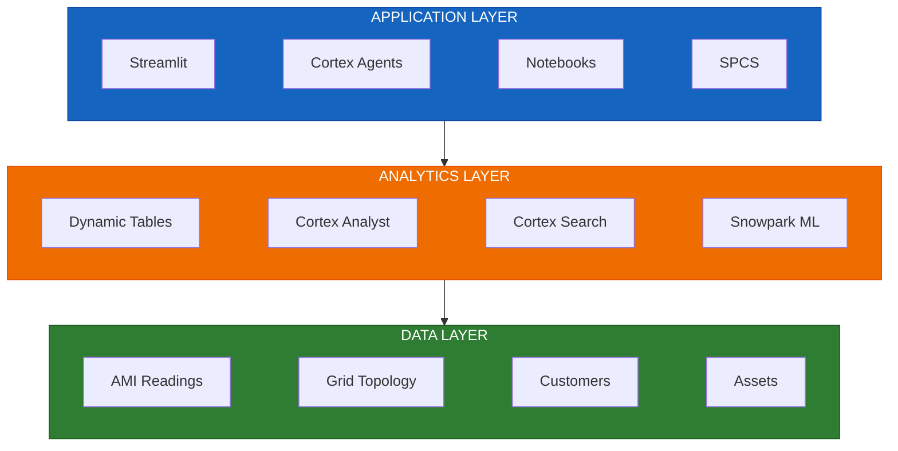
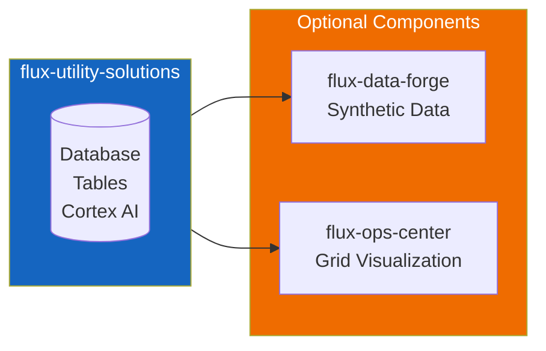
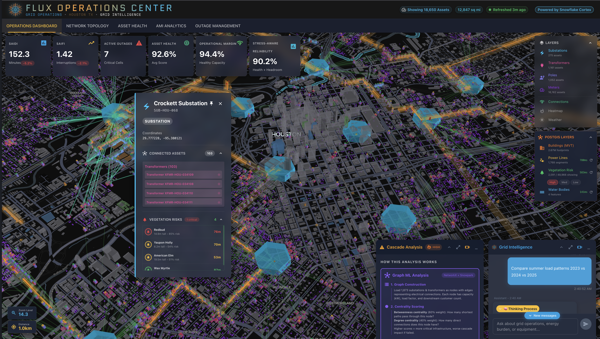
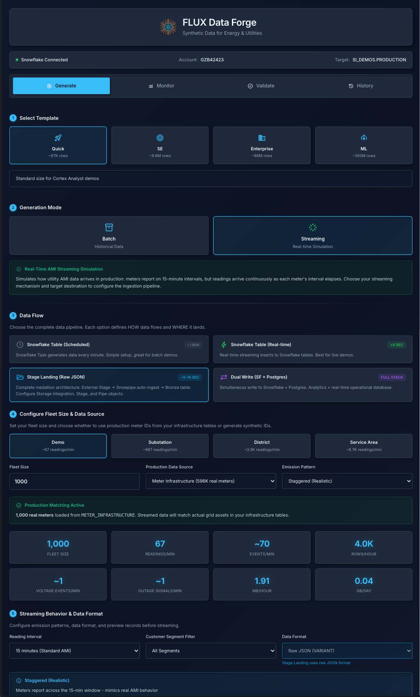

# Flux Utility Solutions

<p align="center">
  
</p>

[](https://www.snowflake.com)
[](LICENSE)

**A reference implementation for electric utility analytics on Snowflake.** Demonstrates Cortex AI, semantic models, and data engineering patterns for grid infrastructure data.

---

## Why Flux Utility Solutions?

This repository provides a foundation for utility-focused Snowflake demos:

| What You Get | Description |
|--------------|-------------|
| **Ready-to-use data model** | Pre-built schemas for substations, transformers, meters, and customers |
| **Cortex AI examples** | Working Analyst, Search, and Agent configurations for natural language queries |
| **Multiple deployment paths** | CLI, SQL scripts, Notebooks, Git integration, or Terraform |
| **Extensible platform** | Foundation for [Flux Data Forge](https://github.com/sfc-gh-abannerjee/flux-data-forge) and [Flux Ops Center](https://github.com/sfc-gh-abannerjee/flux-ops-center-spcs) |

---

## Quick Start

```bash
git clone https://github.com/sfc-gh-abannerjee/flux-utility-solutions.git
cd flux-utility-solutions
./cli/quickstart.sh -c <connection_name>
```

**What you get:** Database with schemas, core tables (Substations, Transformers, Meters, Customers), sample data, and warehouse configured.

---

## Snowflake Features

| Category | Features |
|----------|----------|
| **Cortex AI** | [Analyst](https://docs.snowflake.com/en/user-guide/snowflake-cortex/cortex-analyst), [Search](https://docs.snowflake.com/en/user-guide/snowflake-cortex/cortex-search/cortex-search-overview), [Agents](https://docs.snowflake.com/en/user-guide/snowflake-cortex/cortex-agents), [LLM Functions](https://docs.snowflake.com/en/user-guide/snowflake-cortex/llm-functions), [Semantic Views](https://docs.snowflake.com/en/user-guide/views-semantic) |
| **Data Engineering** | [Dynamic Tables](https://docs.snowflake.com/en/user-guide/dynamic-tables-about), [Streams](https://docs.snowflake.com/en/user-guide/streams-intro), [Tasks](https://docs.snowflake.com/en/user-guide/tasks-intro), [Snowpipe](https://docs.snowflake.com/en/user-guide/data-load-snowpipe-intro) |
| **Machine Learning** | [Snowpark ML](https://docs.snowflake.com/en/developer-guide/snowflake-ml/overview), [Model Registry](https://docs.snowflake.com/en/developer-guide/snowflake-ml/model-registry/overview), [Feature Store](https://docs.snowflake.com/en/developer-guide/snowflake-ml/feature-store/overview) |
| **Applications** | [Streamlit](https://docs.snowflake.com/en/developer-guide/streamlit/about-streamlit), [SPCS](https://docs.snowflake.com/en/developer-guide/snowpark-container-services/overview), [Notebooks](https://docs.snowflake.com/en/user-guide/ui-snowsight/notebooks) |

---

## Documentation

| Document | Description |
|----------|-------------|
| [DEPLOYMENT.md](./docs/DEPLOYMENT.md) | Step-by-step deployment guide |
| [ARCHITECTURE.md](./docs/ARCHITECTURE.md) | System design and diagrams |
| [AI_ARCHITECTURE.md](./docs/AI_ARCHITECTURE.md) | Cortex AI configuration |
| [DATA_MODEL.md](./docs/DATA_MODEL.md) | Schema documentation |
| [DEPENDENCIES.md](./docs/DEPENDENCIES.md) | Inter-repository dependencies |
| [TERRAFORM_GUIDE.md](./docs/TERRAFORM_GUIDE.md) | Infrastructure as Code guide |

---

## Architecture



**[Detailed Architecture →](./docs/ARCHITECTURE.md)**

---

## Features


<table>
<tr>
<td align="center"><br/><b>Grid Intelligence Agent</b><br/>Natural language grid queries</td>
<td align="center"><br/><b>H3 Grid Visualization</b><br/>Hexagonal topology maps</td>
</tr>
<tr>
<td align="center"><br/><b>Cortex Search Services</b><br/>Semantic customer search</td>
<td align="center"><br/><b>Predictive Maintenance</b><br/>ML-based risk scoring</td>
</tr>
</table>

| Use Case | What It Does | Location |
|----------|--------------|----------|
| **Grid Visualization** | H3 hexagonal maps with real-time topology | `streamlit/geospatial/` |
| **AMI Analytics** | Smart meter time-series analysis | `notebooks/demos/` |
| **Customer 360** | Unified customer view with semantic search | `scripts/09_cortex_search_services.sql` |
| **Predictive Maintenance** | ML-based transformer risk scoring | `scripts/11_ml_feature_tables.sql` |
| **Conversational Analytics** | Natural language grid intelligence | `agents/` |
| **Outage Management** | Real-time tracking and restoration | `streamlit/outage_dashboard.py` |

---

## Flux Platform Ecosystem

This repo is the **core foundation**. Deploy it first, then add optional components:



| Repository | Purpose | 
|------------|---------|
| **Flux Utility Solutions** (this repo) | Core platform - database, Cortex AI, semantic models |
| [Flux Data Forge](https://github.com/sfc-gh-abannerjee/flux-data-forge) | Synthetic AMI data generation with streaming |
| [Flux Ops Center](https://github.com/sfc-gh-abannerjee/flux-ops-center-spcs) | Real-time grid visualization, GNN risk prediction |

<table>
<tr>
<td align="center"><br/><a href="https://github.com/sfc-gh-abannerjee/flux-ops-center-spcs"><b>Flux Ops Center</b></a><br/>Real-time grid visualization, GNN cascade analysis<br/><br/><a href="https://github.com/sfc-gh-abannerjee/flux-ops-center-spcs/blob/main/docs/DOCKER_IMAGES.md">Docker Images</a> · <a href="https://github.com/sfc-gh-abannerjee/flux-ops-center-spcs/blob/main/docs/deployment/">Deployment</a></td>
<td align="center"><br/><a href="https://github.com/sfc-gh-abannerjee/flux-data-forge"><b>Flux Data Forge</b></a><br/>Synthetic data generation, streaming pipelines</td>
</tr>
</table>

> **Note:** Flux Data Forge and Flux Ops Center can also run standalone. See their READMEs.

---

## Deployment Options

> **One solution. Five ways to build.**

| Path | Best For | Guide |
|------|----------|-------|
| **CLI Quick Start** | Demos, POCs, fastest setup | `./cli/quickstart.sh -c <connection_name>` |
| **SQL Scripts** | Learning, auditing, step-by-step control | [scripts/](./scripts/) |
| **Notebooks** | Workshops, data science teams | [notebooks/](./notebooks/) |
| **Git Integration** | GitOps, CI/CD pipelines | [git_deploy/](./git_deploy/) |
| **Terraform** | Enterprise IaC, multi-environment | [terraform/](./terraform/) |


### Prerequisites

| Requirement | Notes |
|-------------|-------|
| Snowflake account | ACCOUNTADMIN role recommended |
| [Snow CLI](https://docs.snowflake.com/en/developer-guide/snowflake-cli/index) | Required for CLI deployment |
| Python 3.10+ | Optional: data generators |
| Terraform 1.5+ | Optional: IaC deployment |

---

## Sample Data

Bundled seed data for immediate exploration:

| Dataset | Records | Description |
|---------|---------|-------------|
| Substations | 269 | Grid infrastructure |
| Transformers | 100 | Asset health data |
| Meters | 100 | AMI metadata |
| Customers | 94 | Customer records |

```bash
# Generate more data
python generators/generate_all.py --size full
```

> **For large-scale AMI data (millions of rows), see** [Flux Data Forge](https://github.com/sfc-gh-abannerjee/flux-data-forge).

---

## Repository Structure

```
flux-utility-solutions/
├── cli/               # Quick start scripts
├── scripts/           # SQL deployment (01-30)
├── notebooks/         # Snowflake Notebooks
├── git_deploy/        # Git integration
├── terraform/         # Infrastructure as Code
├── streamlit/         # Streamlit apps
├── agents/            # Cortex Agent definitions
├── models/            # Semantic models
├── seed_data/         # Sample data (CSV, Parquet)
├── generators/        # Script-based generators
└── docs/              # Documentation
```

---

## Contributing

See [CONTRIBUTING.md](CONTRIBUTING.md) for guidelines.

## License

Apache 2.0 - See [LICENSE](./LICENSE)

---

<p align="center">
  <strong>Built for Snowflake AI Data Cloud</strong>
</p>
