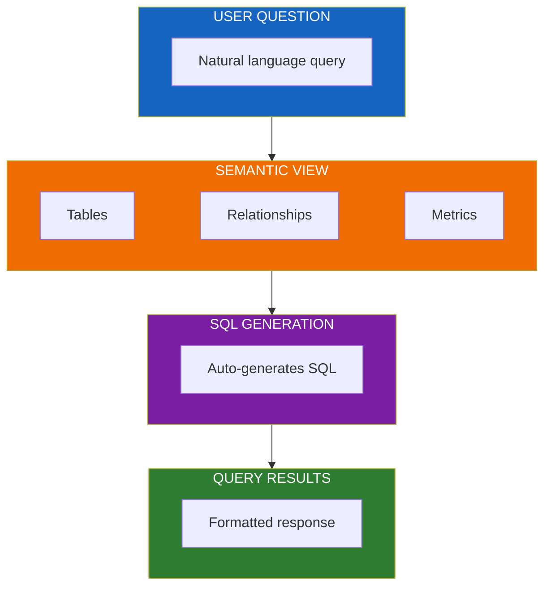
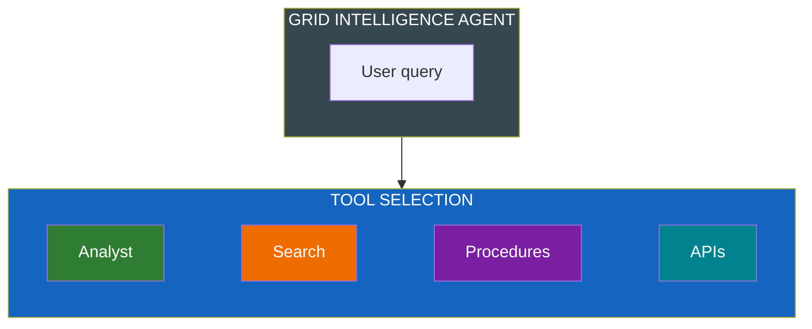
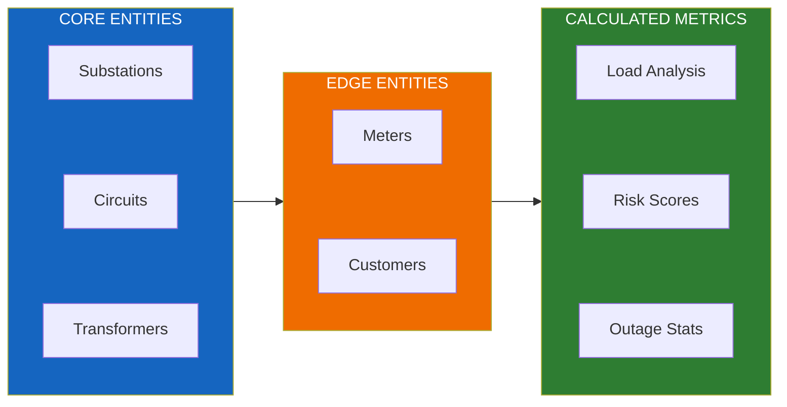

# AI Architecture

Flux Utility Solutions leverages Snowflake Cortex AI capabilities for intelligent grid operations.

---

## Cortex Analyst (Natural Language SQL)

Enables business users to query data using natural language:



**Key Features:**
- Natural language to SQL translation
- 30+ tables with semantic relationships
- Automatic join construction
- Formatted, user-friendly responses

---

## Cortex Search (RAG)

Multiple search services for different data domains:

| Search Service | Content | Use Case |
|----------------|---------|----------|
| Customer Search | Customer profiles | "Find John Smith on Oak Street" |
| Meter Search | Meter metadata | "Look up meter MTR-12345" |
| Asset Search | Equipment specs | "Find transformer specifications" |
| Document Search | Technical manuals | "How to maintain transformers" |

---

## Cortex Agent (Multi-Tool)

Orchestrates multiple AI capabilities:



**Available Tools:**

| Tool | Capability | Example Use |
|------|------------|-------------|
| **Analyst** | Natural language SQL | "What's the load on substation 5?" |
| **Search** | RAG retrieval | "Find customer John Smith" |
| **Procedures** | Cascade logic | Run complex multi-step operations |
| **External APIs** | HTTP requests | Weather data, external systems |

---

## Semantic Model Design

The semantic view defines relationships across utility data domains:



**Relationship Types:**
- **One-to-Many**: Substation → Circuits → Transformers
- **Many-to-Many**: Transformers ↔ Meters (via service points)
- **Hierarchical**: Grid topology parent-child relationships

---

## Configuration

### Semantic View Setup

```sql
CREATE OR REPLACE SEMANTIC VIEW flux_semantic_view
  TABLES (
    substations,
    circuits,
    transformers,
    meters,
    customers
  )
  RELATIONSHIPS (
    substations(substation_id) -> circuits(substation_id),
    circuits(circuit_id) -> transformers(circuit_id),
    transformers(transformer_id) -> meters(transformer_id)
  );
```

### Search Service Setup

```sql
CREATE OR REPLACE CORTEX SEARCH SERVICE customer_search
  WAREHOUSE = flux_wh
  TARGET_LAG = '1 hour'
  ON customer_name, address, account_number
  AS SELECT * FROM customers;
```

---

## Best Practices

1. **Semantic Views**: Define clear relationships and metrics for accurate SQL generation
2. **Search Services**: Index frequently searched fields with appropriate target lag
3. **Agents**: Use cascading tools for complex multi-step operations
4. **Testing**: Validate natural language queries against expected SQL output

See [CORTEX_GUIDE.md](./CORTEX_GUIDE.md) for detailed configuration instructions.
