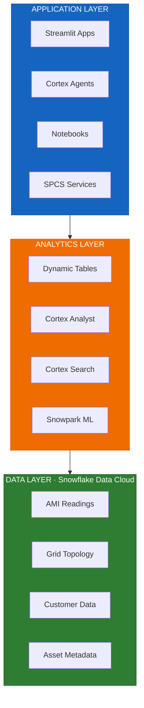
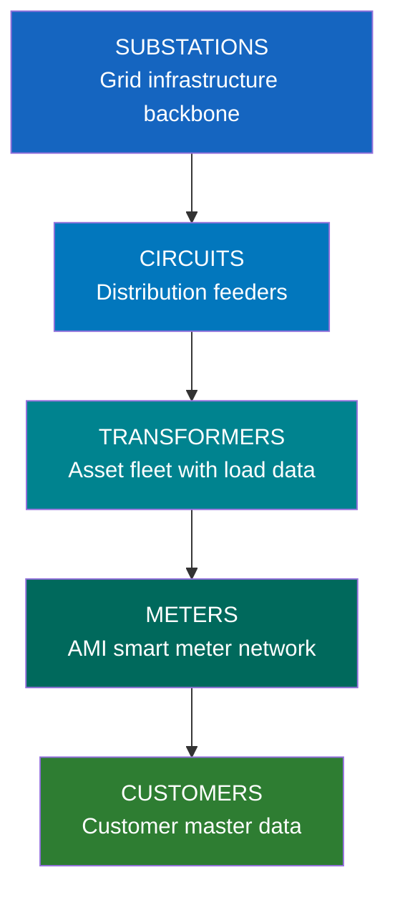
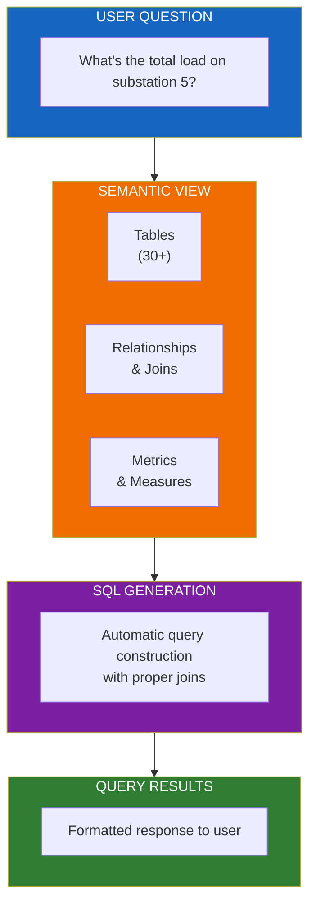
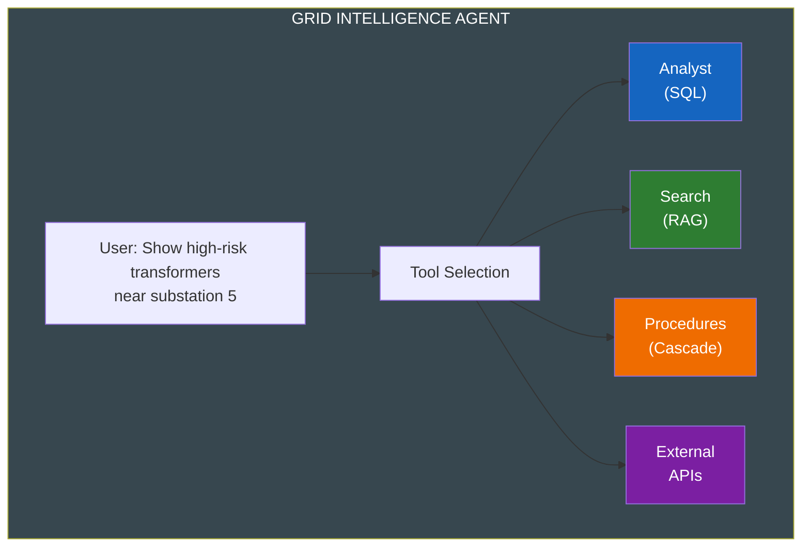
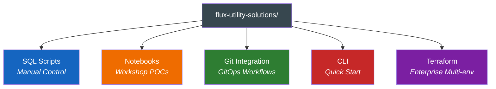
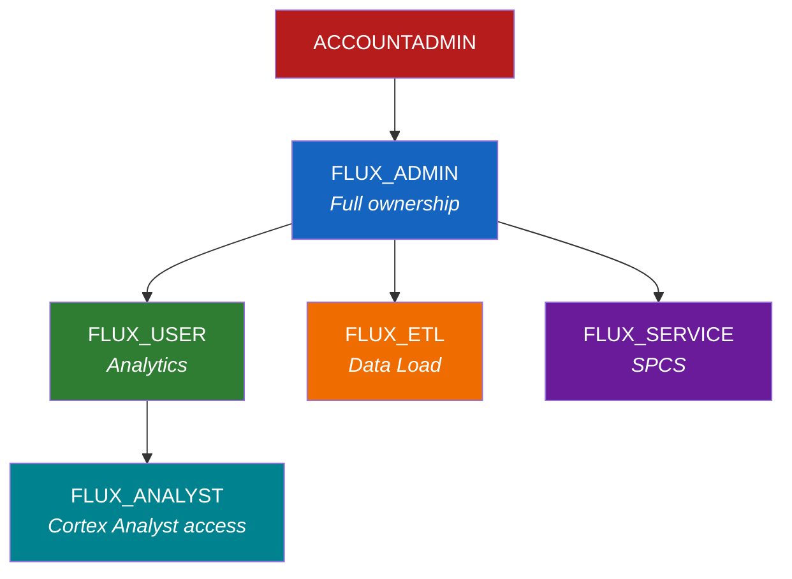

# Flux Utility Solutions - Architecture

A comprehensive reference architecture for utility companies building grid operations and analytics solutions on Snowflake's AI Data Cloud.

## Overview

Flux Utility Solutions demonstrates a **modern data platform architecture** that combines real-time operations, large-scale analytics, and AI capabilities in a unified solution.

---

## Core Components

### Data Layer

The foundation layer stores and manages all utility data in Snowflake:

| Schema | Purpose | Key Objects |
|--------|---------|-------------|
| **PRODUCTION** | Core operational data | Substations, Transformers, Meters, Customers |
| **APPLICATIONS** | AI services and apps | Semantic Views, Search Services, Streamlit Apps |
| **SECRETS** | Credentials and configs | API keys, connection strings |

**Key Data Domains:**

### Analytics Layer

Leverages Snowflake's native capabilities for advanced analytics:

| Capability | Use Case | Implementation |
|------------|----------|----------------|
| **Dynamic Tables** | Bronze → Silver → Gold pipelines | Declarative transformations |
| **Cortex Analyst** | Natural language SQL | Semantic models with relationships |
| **Cortex Search** | RAG and document search | Customer, meter, and document indices |
| **Snowpark ML** | Predictive maintenance | XGBoost transformer risk models |

### Application Layer

Multiple interfaces for different user personas:

| Application | Technology | Purpose |
|-------------|------------|---------|
| **Geospatial H3 App** | Streamlit | H3 hexagonal grid visualization |
| **Grid Map App** | Streamlit | Real-time topology monitoring |
| **Load Analytics** | Streamlit | Transformer capacity analysis |
| **Outage Dashboard** | Streamlit | Outage tracking and restoration |
| **Grid Intelligence Agent** | Cortex Agent | Conversational analytics assistant |
| **Notebooks** | Snowflake Notebooks | Interactive data exploration |

---

## AI Architecture

### Cortex Analyst (Natural Language SQL)

Enables business users to query data using natural language:

### Cortex Search (RAG)

Multiple search services for different data domains:

| Search Service | Content | Use Case |
|----------------|---------|----------|
| Customer Search | Customer profiles | "Find John Smith on Oak Street" |
| Meter Search | Meter metadata | "Look up meter MTR-12345" |
| Asset Search | Equipment specs | "Find transformer specifications" |
| Document Search | Technical manuals | "How to maintain transformers" |

### Cortex Agent (Multi-Tool)

Orchestrates multiple AI capabilities:

---

## Deployment Architecture

### Five Deployment Paths

All paths deploy identical infrastructure - choose based on your team's preferences:

| Path | Best For | Key Feature |
|------|----------|-------------|
| **SQL Scripts** | Learning, auditing | Full visibility into each step |
| **Notebooks** | POC workshops | Interactive, documented execution |
| **Git Integration** | Modern DevOps | EXECUTE IMMEDIATE FROM repository |
| **CLI** | Quick demos | Single-command deployment |
| **Terraform** | Enterprise | Multi-environment, state management |

### Deployment Phases

Regardless of path chosen, deployment follows these phases:

```mermaid
flowchart LR
    subgraph P1["PHASE 1-3: FOUNDATION"]
        A1["Infrastructure<br/>Database, Schemas"]
        A2["Reference Data<br/>Substations, Circuits"]
        A3["Core Tables<br/>Transformers, Meters"]
    end
    
    subgraph P2["PHASE 4-6: ANALYTICS"]
        B1["Views & Analytics<br/>Dynamic Tables"]
        B2["Streamlit Apps<br/>Dashboards"]
        B3["Notebooks<br/>Setup, Demos"]
    end
    
    subgraph P3["PHASE 7-10: FINALIZATION"]
        C1["ML Features<br/>Model Registry"]
        C2["Security<br/>RBAC Roles"]
        C3["Seed Data<br/>Sample Loading"]
        C4["Validation<br/>Verification"]
    end
    
    P1 --> P2 --> P3
    
    style P1 fill:#1565c0,color:#fff
    style P2 fill:#ef6c00,color:#fff
    style P3 fill:#2e7d32,color:#fff
```

---

## Security Model

### Role-Based Access Control (RBAC)

### Permission Matrix

| Role | Database | Warehouse | Semantic Views | Search | Agents |
|------|----------|-----------|----------------|--------|--------|
| Admin | OWNERSHIP | OPERATE | ALL | ALL | ALL |
| User | USAGE | USAGE | SELECT | QUERY | USAGE |
| Analyst | USAGE | USAGE | SELECT | QUERY | - |
| ETL | MODIFY | USAGE | - | - | - |
| Service | USAGE | USAGE | - | - | USAGE |

---

## Scalability

### Data Volume Guidelines

| Table Type | Expected Scale | Optimization |
|------------|----------------|--------------|
| AMI Readings | Billions of rows | Clustered by (timestamp, meter_id) |
| Transformer Load | Hundreds of millions | Clustered by (transformer_id, hour) |
| Customer Data | Hundreds of thousands | Cortex Search indexed |
| Asset Metadata | Thousands | Standard tables |

### Warehouse Sizing Recommendations

| Workload | Warehouse Size | Notes |
|----------|----------------|-------|
| Interactive queries | X-SMALL to SMALL | Auto-suspend 60s |
| AMI aggregations | MEDIUM to LARGE | Date-range queries |
| ML training | MEDIUM with GPU | Model fitting |
| Search indexing | SMALL | Background refresh |
| Bulk data loading | SMALL to MEDIUM | Parallel ingestion |

---

## Integration Points

### External Integrations

| Integration | Purpose | Implementation |
|-------------|---------|----------------|
| GitHub | Version control, GitOps | Git repository stage |
| Weather APIs | Outage correlation | External access integration |
| GIS Systems | Geospatial data | H3 hexagonal indexing |
| SCADA | Real-time operations | Streaming ingestion |

### Internal Snowflake Features

| Feature | Usage |
|---------|-------|
| Dynamic Tables | Declarative data pipelines |
| Streams & Tasks | CDC and scheduling |
| Snowpipe | Automated data ingestion |
| Model Registry | ML model versioning |
| Stages | File storage and Git integration |

---

## Getting Started

1. **Choose your deployment path** based on team preferences
2. **Clone the repository** and review documentation
3. **Configure connection** using Snow CLI or Terraform
4. **Deploy infrastructure** following the chosen path
5. **Load seed data** for immediate exploration
6. **Explore applications** - Streamlit apps and notebooks

See [README.md](../README.md) for quick start instructions.

---

## Additional Resources

| Document | Description |
|----------|-------------|
| [DATA_MODEL.md](./DATA_MODEL.md) | Detailed schema documentation |
| [CORTEX_GUIDE.md](./CORTEX_GUIDE.md) | AI features configuration |
| [TERRAFORM_GUIDE.md](./TERRAFORM_GUIDE.md) | Infrastructure as Code guide |
| [DEPLOYMENT.md](./DEPLOYMENT.md) | Step-by-step deployment |
