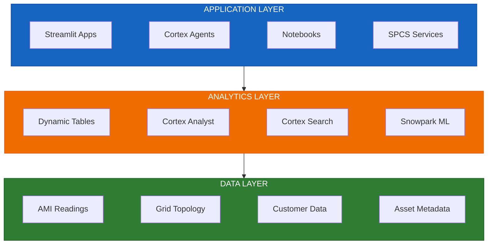
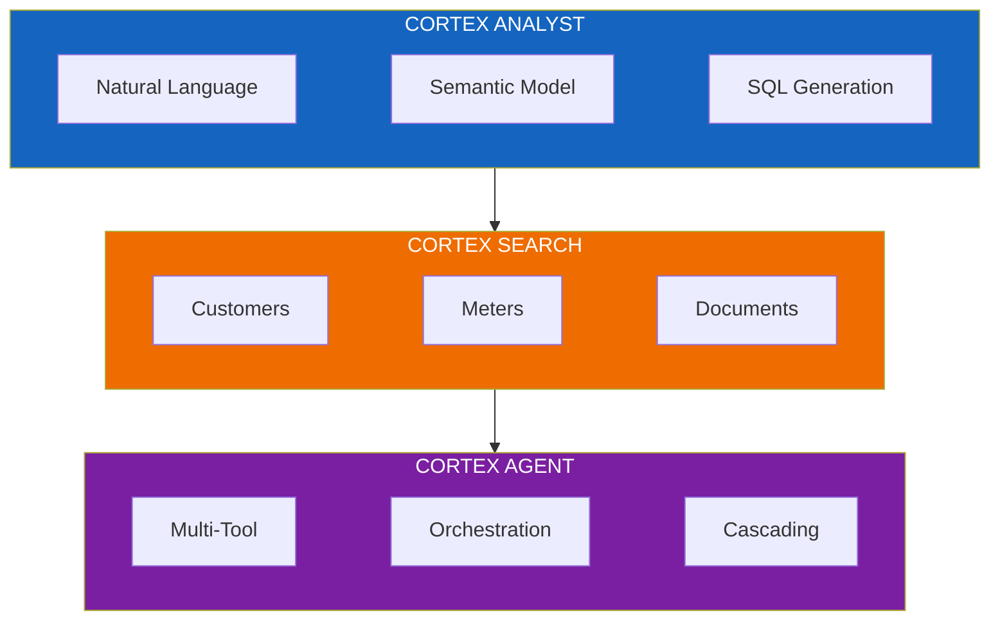
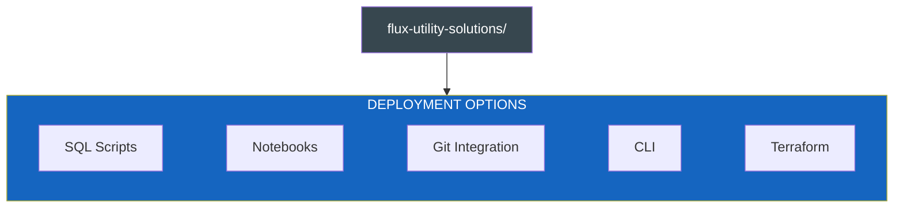
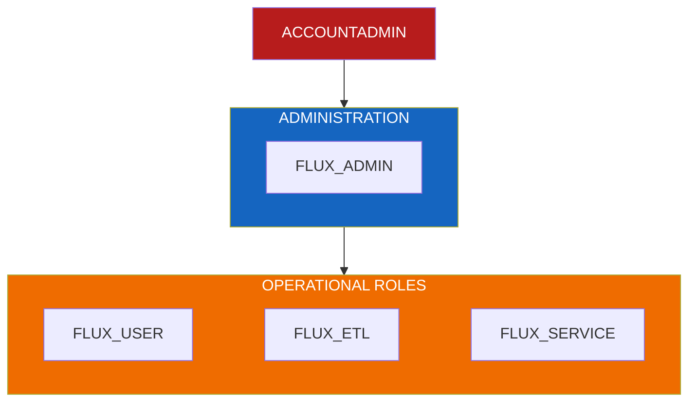

# Flux Utility Solutions - Architecture

A comprehensive reference architecture for utility companies building grid operations and analytics solutions on Snowflake's AI Data Cloud.

## Overview

Flux Utility Solutions demonstrates a **modern data platform architecture** that combines real-time operations, large-scale analytics, and AI capabilities in a unified solution.

---

## Core Components

### Data Layer

The foundation layer stores and manages all utility data in Snowflake:

| Schema | Purpose | Key Objects |
|--------|---------|-------------|
| **PRODUCTION** | Core operational data | Substations, Transformers, Meters, Customers |
| **APPLICATIONS** | AI services and apps | Semantic Views, Search Services, Streamlit Apps |
| **SECRETS** | Credentials and configs | API keys, connection strings |

**Data Flow:**

### Analytics Layer

Leverages Snowflake's native capabilities for advanced analytics:

| Capability | Use Case | Implementation |
|------------|----------|----------------|
| **Dynamic Tables** | Bronze → Silver → Gold pipelines | Declarative transformations |
| **Cortex Analyst** | Natural language SQL | Semantic models with relationships |
| **Cortex Search** | RAG and document search | Customer, meter, and document indices |
| **Snowpark ML** | Predictive maintenance | XGBoost transformer risk models |

### Application Layer

Multiple interfaces for different user personas:

| Application | Technology | Purpose |
|-------------|------------|---------|
| **Geospatial H3 App** | Streamlit | H3 hexagonal grid visualization |
| **Grid Map App** | Streamlit | Real-time topology monitoring |
| **Load Analytics** | Streamlit | Transformer capacity analysis |
| **Outage Dashboard** | Streamlit | Outage tracking and restoration |
| **Grid Intelligence Agent** | Cortex Agent | Conversational analytics assistant |

---

## AI Capabilities Overview

See [AI_ARCHITECTURE.md](./AI_ARCHITECTURE.md) for detailed configuration.

---

## Detailed Documentation

| Document | Description |
|----------|-------------|
| [AI_ARCHITECTURE.md](./AI_ARCHITECTURE.md) | Cortex Analyst, Search, and Agent configuration |
| [DEPLOYMENT_ARCHITECTURE.md](./DEPLOYMENT_ARCHITECTURE.md) | Five deployment paths and phases |
| [SECURITY.md](./SECURITY.md) | RBAC roles and permission matrix |
| [SCALABILITY.md](./SCALABILITY.md) | Data volumes and warehouse sizing |
| [DATA_MODEL.md](./DATA_MODEL.md) | Detailed schema documentation |
| [CORTEX_GUIDE.md](./CORTEX_GUIDE.md) | AI features configuration |
| [TERRAFORM_GUIDE.md](./TERRAFORM_GUIDE.md) | Infrastructure as Code guide |
| [DEPLOYMENT.md](./DEPLOYMENT.md) | Step-by-step deployment |

---

## Quick Reference

### Deployment Paths

### Security Roles

---

## Getting Started

1. **Choose your deployment path** based on team preferences
2. **Clone the repository** and review documentation
3. **Configure connection** using Snow CLI or Terraform
4. **Deploy infrastructure** following the chosen path
5. **Load seed data** for immediate exploration
6. **Explore applications** - Streamlit apps and notebooks

See [README.md](../README.md) for quick start instructions.
