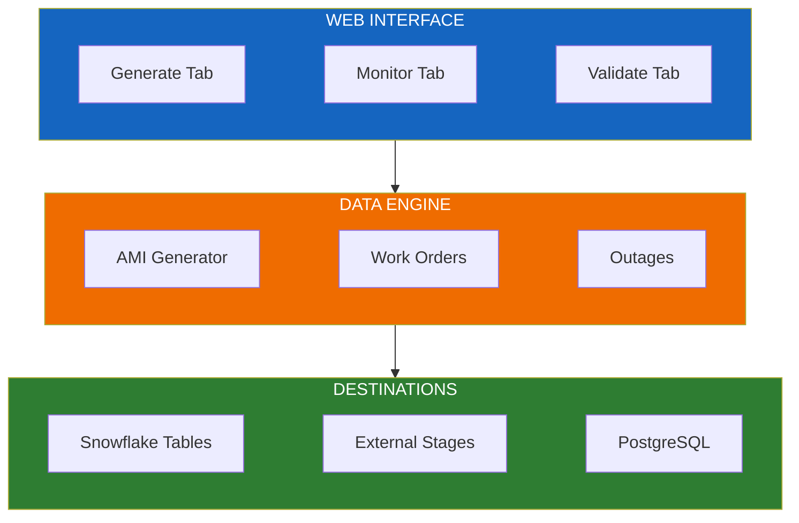
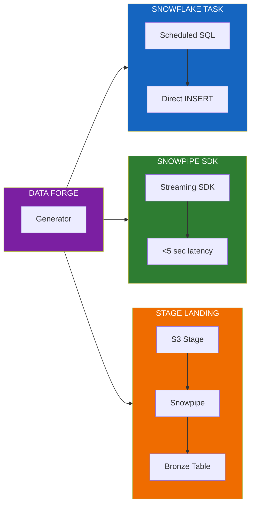

# Flux Data Forge

**A synthetic data generation and streaming pipeline tool for utility demo environments.**

Flux Data Forge is an SPCS (Snowpark Container Services) application that solves a common challenge: creating realistic, high-volume utility grid data for demonstrations, POCs, and ML model training - without requiring access to production customer data.

---

## What It Does

Flux Data Forge provides two core capabilities:

### 1. Batch Data Generation
Generate historical AMI (Advanced Metering Infrastructure) datasets with configurable scale:

| Preset | Meters | Time Range | Rows Generated | Generation Time |
|--------|--------|------------|----------------|-----------------|
| Quick Demo | 100 | 7 days | ~67K | ~5 minutes |
| SE Demo | 1,000 | 90 days | ~8.6M | ~15 minutes |
| Enterprise POC | 5,000 | 180 days | ~86M | ~1 hour |
| ML Training | 10,000 | 365 days | ~350M | ~4 hours |

### 2. Real-Time Streaming Pipelines
Demonstrate different data ingestion patterns with varying latency characteristics:

| Pipeline Mode | Latency | How It Works |
|--------------|---------|--------------|
| **Snowflake Task** | ~1 min | Scheduled SQL task generates and inserts data at intervals |
| **Snowpipe Streaming** | <5 sec | Uses Snowpipe Streaming SDK for low-latency inserts |
| **Stage Landing** | ~5-10 sec | JSON to S3 stage, Snowpipe auto-ingest to Bronze table |
| **Dual Write** | Variable | Simultaneous write to Snowflake + PostgreSQL |

---

## Architecture



### Data Flow Options



---

## Generated Data Types

### AMI Interval Readings
The core data type - smart meter readings with realistic patterns:

| Field | Type | Description |
|-------|------|-------------|
| `METER_ID` | VARCHAR | Unique meter identifier |
| `TRANSFORMER_ID` | VARCHAR | Parent transformer |
| `CIRCUIT_ID` | VARCHAR | Distribution circuit |
| `READING_TIMESTAMP` | TIMESTAMP | Reading time |
| `USAGE_KWH` | FLOAT | Energy consumption |
| `VOLTAGE` | FLOAT | Voltage reading (118-122V nominal) |
| `POWER_FACTOR` | FLOAT | Power factor (0.92-0.99) |
| `CUSTOMER_SEGMENT` | VARCHAR | RESIDENTIAL, COMMERCIAL, INDUSTRIAL |
| `DATA_QUALITY` | VARCHAR | VALID, ANOMALY, OUTAGE |

**Realistic patterns include:**
- Time-of-day usage curves (peak hours: 2-7 PM)
- Customer segment multipliers (Industrial: 15x, Commercial: 5x)
- 1-2% data quality anomalies
- Geographic correlation via lat/lon

### Correlated Operational Data
When the generators module is available, Data Forge can also create:

| Data Type | Description | Correlation |
|-----------|-------------|-------------|
| **Work Orders** | SAP-style maintenance records | Linked to transformers, circuits |
| **Outage Events** | ERM-style outage tracking | Weather and asset health driven |
| **Power Quality** | Voltage sag/swell events | Correlated with meter readings |
| **Transformer Load** | Time-series load data | Aggregated from meter readings |

---

## Emission Patterns

Simulate realistic AMI network behavior:

| Pattern | Meter Report % | Stagger | Use Case |
|---------|----------------|---------|----------|
| **Uniform** | 100% | None | Max throughput testing |
| **Staggered Realistic** | 100% | 15 min | Mimics real AMI behavior |
| **Partial Reporting** | 98% | 10 min | Realistic data quality |
| **Degraded Network** | 85% | 15 min | Storm conditions simulation |

---

## Utility Profiles

Data can be generated with regional characteristics:

| Profile | Region | Characteristics |
|---------|--------|-----------------|
| Texas Gulf Coast | ERCOT | Hot humid, high summer AC load |
| California Coastal | CAISO | Mediterranean, evening peaks |
| Northeast Corridor | NYISO | Cold winters, hot summers |
| Midwest Great Lakes | MISO | Extreme cold winters |
| Southeast Sunbelt | SERC | High AC load, mild winters |
| Pacific Northwest | BPA | Marine climate, winter heating |

---

## Capabilities

### Strengths

- **Scale**: Reliably generates datasets from 67K to 350M+ rows
- **Realism**: Time-of-day patterns, segment-based consumption, and anomalies create believable data
- **Flexibility**: Multiple pipeline modes for different demo scenarios
- **Production Matching**: Can use real meter IDs from existing infrastructure tables
- **Web UI**: FastAPI interface works reliably in SPCS environment

### When to Use Data Forge vs Scripts

| Scenario | Recommendation |
|----------|----------------|
| Quick demo, <10M rows | Scripts in `generators/` folder |
| Streaming pipeline demo | **Data Forge** |
| POC with realistic volumes | **Data Forge** |
| ML model training data | **Data Forge** |
| Simple data exploration | Scripts or notebooks |
| Custom data patterns | Modify `generators.py` module |

---

## Deployment

### Prerequisites

1. **Compute Pool**: CPU_X64_S, 1-2 nodes
2. **Image Repository**: For Docker images
3. **Secrets**: RSA key for Snowpipe Streaming SDK (optional)
4. **External Access Integration**: For PostgreSQL dual-write (optional)

### Quick Deploy

```bash
cd spcs/flux_data_forge
./build_and_push.sh
```

```sql
CREATE SERVICE FLUX_DATA_FORGE_SERVICE
  IN COMPUTE POOL FLUX_DATA_FORGE_POOL
  FROM @DEPLOYMENT_STAGE
  SPECIFICATION_FILE = 'service_spec.yaml'
  MIN_INSTANCES = 1
  MAX_INSTANCES = 1;
```

### Access the UI

```sql
SHOW ENDPOINTS IN SERVICE FLUX_DATA_FORGE_SERVICE;
-- Navigate to the ingress_url in browser
```

---

## Demo Scenarios

### Scenario 1: Cortex Analyst Demo
Generate 90 days of AMI data for natural language analytics:

1. Deploy Data Forge
2. Select "SE Demo" preset (1K meters, 90 days)
3. Click Generate
4. Query data with Cortex Analyst

### Scenario 2: Streaming Latency Comparison
Show different ingestion latencies side-by-side:

1. Start Snowflake Task stream (~1 min latency)
2. Start Snowpipe Streaming stream (<5 sec)
3. Query both tables to compare arrival times

### Scenario 3: Medallion Architecture
Demonstrate Bronze/Silver/Gold pattern:

1. Select "Stage Landing" mode
2. Configure S3 external stage
3. Watch data flow: S3 → Snowpipe → Bronze → Dynamic Tables

---

## Configuration Reference

### Environment Variables

| Variable | Default | Description |
|----------|---------|-------------|
| `SNOWFLAKE_DATABASE` | FLUX_DATABASE | Target database |
| `SNOWFLAKE_SCHEMA` | PRODUCTION | Target schema |
| `SNOWFLAKE_WAREHOUSE` | SI_DEMO_WH | Query warehouse |
| `POSTGRES_HOST` | - | PostgreSQL for dual write |

### Snowpipe SDK Limits

| Parameter | Value | Notes |
|-----------|-------|-------|
| Max throughput | 10 GB/s | Per channel |
| Optimal batch | 10-16 MB | Best efficiency |
| Max client lag | 1-600 sec | Buffer before flush |
| Channel inactive | 30 days | Auto-cleanup |

---

## File Reference

| File | Purpose |
|------|---------|
| `src/app.py` | FastAPI application (~13K lines) |
| `src/generators.py` | Correlated data generators (~800 lines) |
| `service_spec.yaml` | SPCS service specification |
| `Dockerfile` | Container build |
| `build_and_push.sh` | Build and push script |

---

## Related Documentation

- [Main README](../README.md) - Solution overview
- [ARCHITECTURE.md](./ARCHITECTURE.md) - System architecture
- [DEPLOYMENT.md](./DEPLOYMENT.md) - Full deployment guide
- [Flux Data Forge README](../spcs/flux_data_forge/README.md) - Technical details

---

## Summary

Flux Data Forge is a practical tool for creating realistic utility grid data at scale. It excels at generating demo-ready AMI datasets and showcasing Snowflake's streaming capabilities. For simpler data needs, the script-based generators may be more appropriate. For production data pipelines, use standard ETL patterns with real source systems.

**Best use cases:**
- Customer POC environments requiring realistic data volumes
- Streaming pipeline demonstrations (Snowpipe SDK, medallion architecture)
- ML model training with large historical datasets
- Cortex Analyst demos needing queryable AMI data
