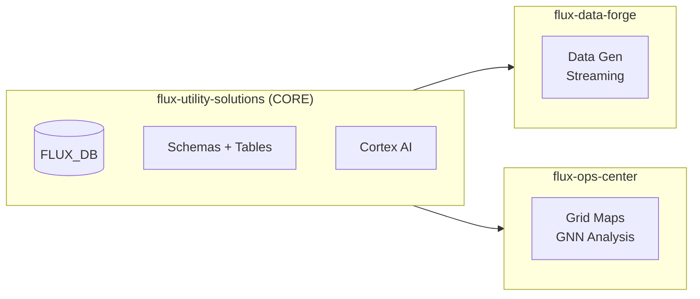

# Flux Platform Dependencies

This document describes the inter-repository dependencies in the Flux Utility Platform and the correct deployment order.

## Repository Overview

The Flux Platform consists of three interconnected repositories:

| Repository | Purpose | Dependencies |
|------------|---------|--------------|
| **flux-utility-solutions** | Core platform, data model, Cortex AI | None (foundation) |
| **flux-data-forge** | Synthetic AMI data generation | flux-utility-solutions |
| **flux-ops-center-spcs** | Real-time grid visualization | flux-utility-solutions |



## Deployment Order

### Step 1: Deploy flux-utility-solutions (Required)

This is the foundation - deploy it first.

```bash
# Clone and deploy with your database name
git clone https://github.com/sfc-gh-abannerjee/flux-utility-solutions.git
cd flux-utility-solutions

# Basic deployment (core tables + Cortex AI)
./cli/quickstart.sh --database MY_FLUX_DB

# Full deployment with Ops Center dependencies
./cli/quickstart.sh --database MY_FLUX_DB --with-ops-center
```

**What gets created:**

| Schema | Objects | Purpose |
|--------|---------|---------|
| PRODUCTION | SUBSTATIONS, TRANSFORMER_METADATA, METER_INFRASTRUCTURE, AMI_INTERVAL_READINGS, etc. | Core grid data |
| APPLICATIONS | FLUX_OPS_CENTER_KPIS, TOPOLOGY_METRO, TOPOLOGY_FEEDERS, SERVICE_AREAS_MV | Pre-computed views |
| ML_DEMO | GRID_NODES, GRID_EDGES, T_TRANSFORMER_TEMPORAL_TRAINING | GNN graph data |
| CASCADE_ANALYSIS | NODE_CENTRALITY_FEATURES_V2, PRECOMPUTED_CASCADES | Cascade analysis |
| RAW | Staging tables | Data landing zone |

### Step 2: Deploy flux-data-forge (Optional)

Use this if you need to generate synthetic AMI data at scale.

```bash
git clone https://github.com/sfc-gh-abannerjee/flux-data-forge.git
cd flux-data-forge

# Set your database
export SNOWFLAKE_DATABASE=MY_FLUX_DB

# Deploy and generate data
# See flux-data-forge README for full instructions
```

**Writes to:**
- `{DATABASE}.PRODUCTION.AMI_INTERVAL_READINGS`
- `{DATABASE}.PRODUCTION.TRANSFORMER_HOURLY_LOAD`

### Step 3: Deploy flux-ops-center-spcs (Optional)

Use this for real-time grid visualization and GNN cascade analysis.

**Pre-built Docker images** are available - no need to build locally:

```bash
# Pull from GitHub Container Registry (auto-selects your architecture)
docker pull ghcr.io/sfc-gh-abannerjee/flux-ops-center-spcs:main

# For SPCS deployment (requires amd64)
docker pull --platform linux/amd64 ghcr.io/sfc-gh-abannerjee/flux-ops-center-spcs:main
```

| Architecture | Use Case |
|--------------|----------|
| `linux/amd64` | Snowflake SPCS, Intel/AMD servers |
| `linux/arm64` | Apple Silicon (M1/M2/M3/M4), AWS Graviton |

**Full deployment:**

```bash
git clone https://github.com/sfc-gh-abannerjee/flux-ops-center-spcs.git
cd flux-ops-center-spcs

# IMPORTANT: Set your database name
export SNOWFLAKE_DATABASE=MY_FLUX_DB

# Deploy SPCS container
# See flux-ops-center README for full instructions
```

**Reads from:**
- `{DATABASE}.APPLICATIONS.*` (KPI views, topology)
- `{DATABASE}.PRODUCTION.*` (substations, transformers)
- `{DATABASE}.ML_DEMO.*` (grid graph)
- `{DATABASE}.CASCADE_ANALYSIS.*` (centrality features)

**Documentation:**
- [Docker Images Guide](https://github.com/sfc-gh-abannerjee/flux-ops-center-spcs/blob/main/docs/DOCKER_IMAGES.md)
- [Deployment Options](https://github.com/sfc-gh-abannerjee/flux-ops-center-spcs/blob/main/docs/deployment/)
- [API Reference](https://github.com/sfc-gh-abannerjee/flux-ops-center-spcs/blob/main/docs/API_REFERENCE.md)

## Database Configuration

All three repositories support configurable database names via environment variable:

```bash
# Set once, used by all repos
export SNOWFLAKE_DATABASE=MY_FLUX_DB
```

| Repository | Config Method | Default |
|------------|---------------|---------|
| flux-utility-solutions | `--database` flag or scripts variable | FLUX_QUICKSTART |
| flux-data-forge | `SNOWFLAKE_DATABASE` env var | FLUX_DB |
| flux-ops-center-spcs | `SNOWFLAKE_DATABASE` env var | FLUX_DB |

## Schema Dependencies

### Flux Ops Center Requirements

The Ops Center SPCS application requires these objects to exist:

**APPLICATIONS Schema (Views):**
```sql
-- Created by: scripts/30_ops_center_dependencies.sql
FLUX_OPS_CENTER_KPIS
FLUX_OPS_CENTER_TOPOLOGY_METRO
FLUX_OPS_CENTER_TOPOLOGY_FEEDERS
FLUX_OPS_CENTER_SERVICE_AREAS_MV
VEGETATION_RISK_COMPUTED
CIRCUIT_HEALTH_REALTIME
CIRCUIT_OUTAGE_STATUS
```

**ML_DEMO Schema (Tables):**
```sql
-- Created by: scripts/30_ops_center_dependencies.sql
GRID_NODES          -- Graph nodes for GNN
GRID_EDGES          -- Graph edges
T_TRANSFORMER_TEMPORAL_TRAINING  -- ML predictions
V_TRANSFORMER_ML_INFERENCE       -- Latest predictions view
```

**CASCADE_ANALYSIS Schema (Tables):**
```sql
-- Created by: scripts/30_ops_center_dependencies.sql
NODE_CENTRALITY_FEATURES_V2  -- Pre-computed GNN features
PRECOMPUTED_CASCADES         -- Simulated cascade scenarios
GNN_PREDICTIONS              -- Real-time GNN outputs
```

### Flux Data Forge Requirements

The Data Forge only requires the base PRODUCTION schema tables:

```sql
-- Created by: scripts/03_substations_transformers.sql
SUBSTATIONS
TRANSFORMER_METADATA

-- Created by: scripts/04_meters_infrastructure.sql
METER_INFRASTRUCTURE

-- Created by: scripts/06_ami_readings_pipeline.sql
AMI_INTERVAL_READINGS
TRANSFORMER_HOURLY_LOAD
```

## Validation

After deployment, verify dependencies:

```sql
-- Check APPLICATIONS views exist
SELECT TABLE_NAME FROM {DATABASE}.INFORMATION_SCHEMA.VIEWS 
WHERE TABLE_SCHEMA = 'APPLICATIONS';

-- Check ML_DEMO tables exist
SELECT TABLE_NAME FROM {DATABASE}.INFORMATION_SCHEMA.TABLES 
WHERE TABLE_SCHEMA = 'ML_DEMO';

-- Check CASCADE_ANALYSIS tables exist
SELECT TABLE_NAME FROM {DATABASE}.INFORMATION_SCHEMA.TABLES 
WHERE TABLE_SCHEMA = 'CASCADE_ANALYSIS';

-- Verify sample data loaded
SELECT 'GRID_NODES' AS TBL, COUNT(*) FROM {DATABASE}.ML_DEMO.GRID_NODES
UNION ALL
SELECT 'PRECOMPUTED_CASCADES', COUNT(*) FROM {DATABASE}.CASCADE_ANALYSIS.PRECOMPUTED_CASCADES;
```

## Troubleshooting

### "Table does not exist" errors in Ops Center

**Cause:** Ops Center dependencies not deployed.

**Solution:**
```bash
cd flux-utility-solutions
./cli/quickstart.sh --database YOUR_DB --with-ops-center
```

Or run the script directly:
```bash
snow sql -f scripts/30_ops_center_dependencies.sql \
    -D "database=YOUR_DB" \
    -D "warehouse=YOUR_WH" \
    -D "admin_role=ACCOUNTADMIN" \
    -D "user_role=PUBLIC"
```

### "FLUX_DB" database not found

**Cause:** Using old default database name.

**Solution:** Set the `SNOWFLAKE_DATABASE` environment variable:
```bash
export SNOWFLAKE_DATABASE=MY_FLUX_DB
```

### Empty data in Ops Center

**Cause:** Seed data not loaded.

**Solution:** Run seed data loading:
```bash
# From flux-utility-solutions
snow sql -f scripts/50_load_seed_data.sql -D "database=YOUR_DB"

# Or use flux-data-forge for large-scale data
```

## Related Documentation

- [DEPLOYMENT.md](./DEPLOYMENT.md) - Detailed deployment guide
- [ARCHITECTURE.md](./ARCHITECTURE.md) - System architecture
- [DATA_MODEL.md](./DATA_MODEL.md) - Schema documentation
- [Ops Center README](https://github.com/sfc-gh-abannerjee/flux-ops-center-spcs)
- [Data Forge README](https://github.com/sfc-gh-abannerjee/flux-data-forge)
