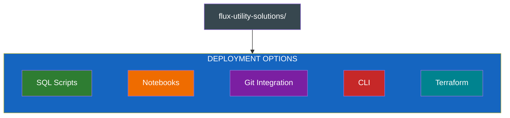
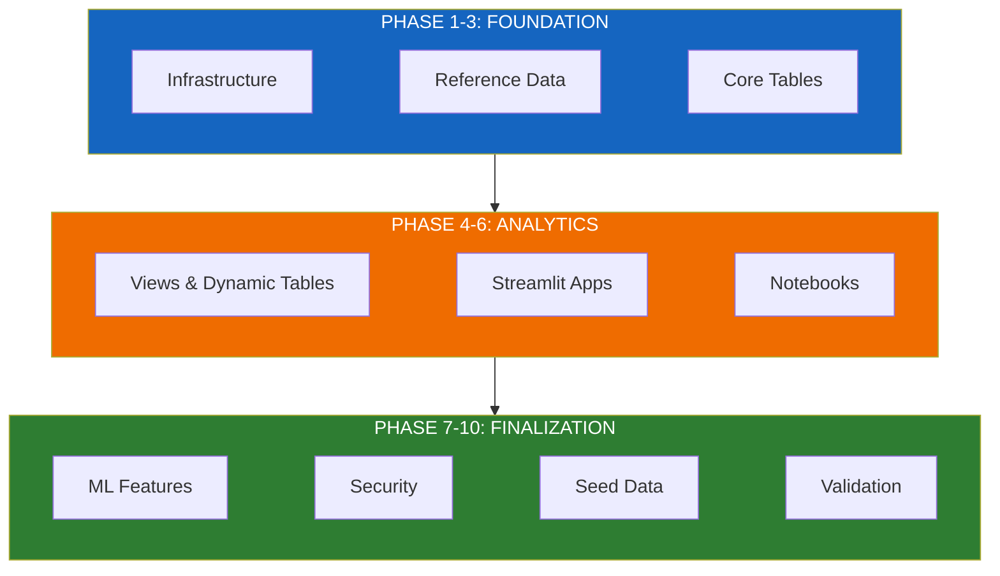
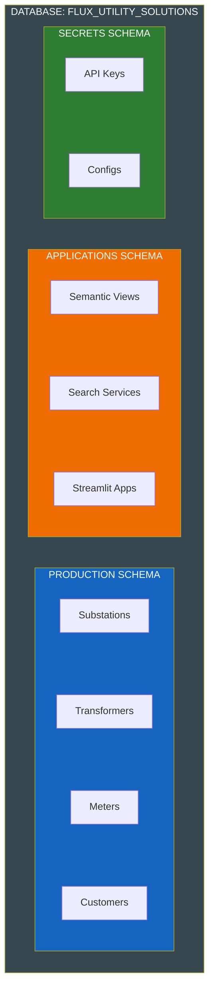

# Deployment Architecture

Multiple deployment paths for different team preferences and environments.

---

## Deployment Paths

All paths deploy identical infrastructure - choose based on your team's preferences:



| Path | Best For | Key Feature |
|------|----------|-------------|
| **SQL Scripts** | Learning, auditing | Full visibility into each step |
| **Notebooks** | POC workshops | Interactive, documented execution |
| **Git Integration** | Modern DevOps | EXECUTE IMMEDIATE FROM repository |
| **CLI** | Quick demos | Single-command deployment |
| **Terraform** | Enterprise | Multi-environment, state management |

---

## Deployment Phases

Regardless of path chosen, deployment follows these phases:



### Phase Details

| Phase | Scripts | Purpose |
|-------|---------|---------|
| **1** | Infrastructure | Database, schemas, warehouse |
| **2** | Reference Data | Substations, circuits |
| **3** | Core Tables | Transformers, meters, customers |
| **4** | Views | Dynamic tables, analytics views |
| **5** | Apps | Streamlit applications |
| **6** | Notebooks | Setup and demo notebooks |
| **7** | ML | Model registry, features |
| **8** | Security | RBAC roles and grants |
| **9** | Seed Data | Sample data loading |
| **10** | Validation | Verification queries |

---

## Path-Specific Instructions

### SQL Scripts

Manual execution with full control:

```bash
# Execute each phase manually
snowsql -f sql/01_infrastructure.sql
snowsql -f sql/02_reference_data.sql
# ... continue through all phases
```

### Notebooks

Interactive workshop execution:

1. Import `notebooks/00_SETUP.ipynb` into Snowflake
2. Run cells sequentially
3. Verify outputs at each step

### Git Integration

GitOps workflow using repository stages:

```sql
-- Execute directly from Git repository
EXECUTE IMMEDIATE FROM @flux_repo/branches/main/sql/01_infrastructure.sql;
```

### CLI

Single-command deployment:

```bash
./cli/quickstart.sh
# Or with custom parameters:
./cli/quickstart.sh --database MY_DB --connection my_connection
```

### Terraform

Enterprise multi-environment:

```bash
cd terraform/
terraform init
terraform plan -var-file="environments/dev.tfvars"
terraform apply -var-file="environments/dev.tfvars"
```

---

## What Gets Deployed



---

## Environment Configuration

### Connection Setup

```toml
# ~/.snowflake/connections.toml
[flux_dev]
account = "your_account"
user = "your_user"
authenticator = "externalbrowser"
database = "FLUX_UTILITY_SOLUTIONS"
schema = "PRODUCTION"
warehouse = "FLUX_WH"
```

### Terraform Variables

```hcl
# environments/dev.tfvars
environment     = "dev"
database_name   = "FLUX_DEV"
warehouse_size  = "XSMALL"
auto_suspend    = 60
```

---

## Validation

After deployment, verify with:

```sql
-- Check infrastructure
SHOW DATABASES LIKE 'FLUX%';
SHOW SCHEMAS IN DATABASE FLUX_UTILITY_SOLUTIONS;
SHOW TABLES IN SCHEMA PRODUCTION;

-- Verify data
SELECT COUNT(*) FROM PRODUCTION.SUBSTATIONS;
SELECT COUNT(*) FROM PRODUCTION.TRANSFORMERS;
```

See [DEPLOYMENT.md](./DEPLOYMENT.md) for detailed step-by-step instructions.
