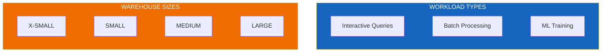
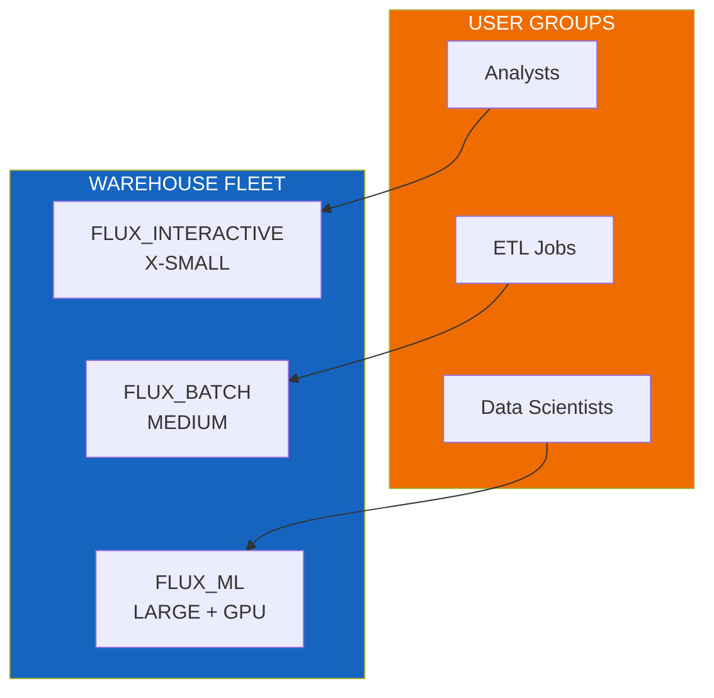

# Scalability Guide

Performance optimization and scaling guidelines for Flux Utility Solutions.

---

## Data Volume Guidelines

| Table Type | Expected Scale | Optimization |
|------------|----------------|--------------|
| AMI Readings | Billions of rows | Clustered by (timestamp, meter_id) |
| Transformer Load | Hundreds of millions | Clustered by (transformer_id, hour) |
| Customer Data | Hundreds of thousands | Cortex Search indexed |
| Asset Metadata | Thousands | Standard tables |

---

## Warehouse Sizing



### Sizing Recommendations

| Workload | Warehouse Size | Auto-Suspend | Notes |
|----------|----------------|--------------|-------|
| Interactive queries | X-SMALL to SMALL | 60s | User dashboards, ad-hoc |
| AMI aggregations | MEDIUM to LARGE | 120s | Date-range queries |
| ML training | MEDIUM with GPU | 300s | Model fitting |
| Search indexing | SMALL | 120s | Background refresh |
| Bulk data loading | SMALL to MEDIUM | 60s | Parallel ingestion |

---

## Clustering Strategies

### AMI Readings Table

```sql
-- Optimal clustering for time-series queries
ALTER TABLE ami_readings 
  CLUSTER BY (reading_timestamp, meter_id);
```

### Transformer Load History

```sql
-- Clustering for asset-based queries
ALTER TABLE transformer_load_history 
  CLUSTER BY (transformer_id, load_hour);
```

---

## Query Optimization

### Use Dynamic Tables

Replace complex views with dynamic tables for frequently accessed aggregations:

```sql
CREATE OR REPLACE DYNAMIC TABLE transformer_daily_summary
  TARGET_LAG = '1 hour'
  WAREHOUSE = FLUX_WH
AS
SELECT
    transformer_id,
    DATE(reading_timestamp) as reading_date,
    AVG(load_kw) as avg_load,
    MAX(load_kw) as peak_load
FROM transformer_load_history
GROUP BY 1, 2;
```

### Partition Pruning

Design queries to leverage clustering:

```sql
-- Good: Leverages time clustering
SELECT * FROM ami_readings
WHERE reading_timestamp BETWEEN '2024-01-01' AND '2024-01-31';

-- Avoid: Full table scan
SELECT * FROM ami_readings
WHERE customer_name = 'John Smith';
```

---

## Search Service Tuning

### Target Lag Configuration

| Service | Target Lag | Rationale |
|---------|------------|-----------|
| Customer Search | 1 hour | Infrequent changes |
| Meter Search | 1 hour | Semi-static data |
| Real-time Alerts | 1 minute | Time-sensitive |

```sql
-- Adjust target lag based on freshness needs
ALTER CORTEX SEARCH SERVICE customer_search
  SET TARGET_LAG = '30 minutes';
```

---

## Multi-Warehouse Strategy

For large deployments, separate warehouses by workload:



```sql
-- Create specialized warehouses
CREATE WAREHOUSE FLUX_INTERACTIVE
  WAREHOUSE_SIZE = 'XSMALL'
  AUTO_SUSPEND = 60;

CREATE WAREHOUSE FLUX_BATCH
  WAREHOUSE_SIZE = 'MEDIUM'
  AUTO_SUSPEND = 120;

CREATE WAREHOUSE FLUX_ML
  WAREHOUSE_SIZE = 'LARGE'
  AUTO_SUSPEND = 300;
```

---

## Monitoring Queries

### Query Performance

```sql
-- Identify slow queries
SELECT 
    query_id,
    query_text,
    total_elapsed_time / 1000 as seconds,
    bytes_scanned / 1e9 as gb_scanned
FROM SNOWFLAKE.ACCOUNT_USAGE.QUERY_HISTORY
WHERE database_name = 'FLUX_UTILITY_SOLUTIONS'
  AND start_time > DATEADD(day, -7, CURRENT_TIMESTAMP())
ORDER BY total_elapsed_time DESC
LIMIT 20;
```

### Warehouse Utilization

```sql
-- Monitor warehouse usage
SELECT 
    warehouse_name,
    DATE(start_time) as date,
    SUM(credits_used) as credits
FROM SNOWFLAKE.ACCOUNT_USAGE.WAREHOUSE_METERING_HISTORY
WHERE warehouse_name LIKE 'FLUX%'
GROUP BY 1, 2
ORDER BY date DESC;
```

---

## Cost Optimization

### Auto-Suspend Settings

| Environment | Auto-Suspend | Rationale |
|-------------|--------------|-----------|
| Development | 60 seconds | Minimize idle costs |
| Production | 120 seconds | Balance cost/latency |
| Batch Jobs | 60 seconds | Job-based scaling |

### Resource Monitors

```sql
-- Set up cost controls
CREATE RESOURCE MONITOR flux_monitor
  WITH CREDIT_QUOTA = 100
  TRIGGERS ON 75 PERCENT DO NOTIFY
           ON 90 PERCENT DO NOTIFY
           ON 100 PERCENT DO SUSPEND;

ALTER WAREHOUSE FLUX_WH SET RESOURCE_MONITOR = flux_monitor;
```

---

## Scaling Checklist

- [ ] Cluster high-volume tables by query patterns
- [ ] Use dynamic tables for frequently accessed aggregations
- [ ] Configure appropriate warehouse sizes per workload
- [ ] Set auto-suspend to minimize idle costs
- [ ] Monitor query performance weekly
- [ ] Review and adjust Search Service target lag
- [ ] Implement resource monitors for cost control
