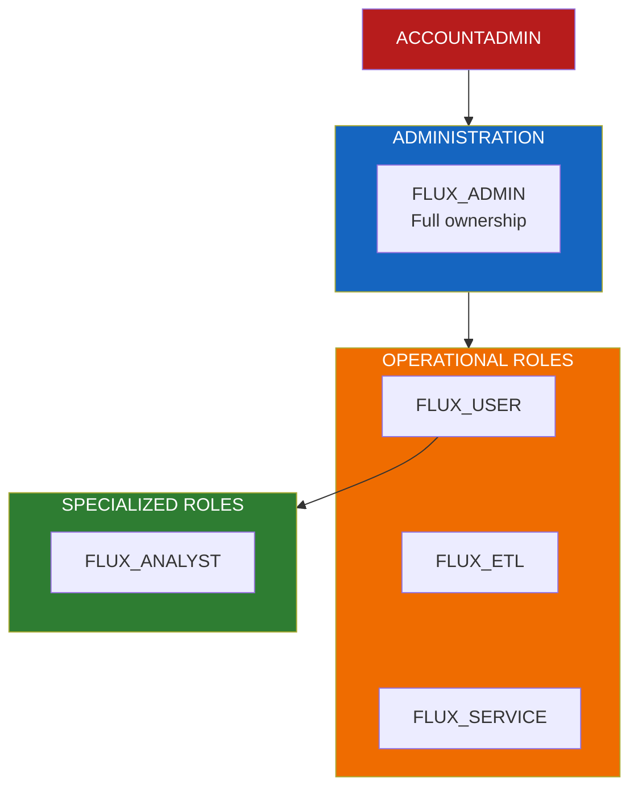
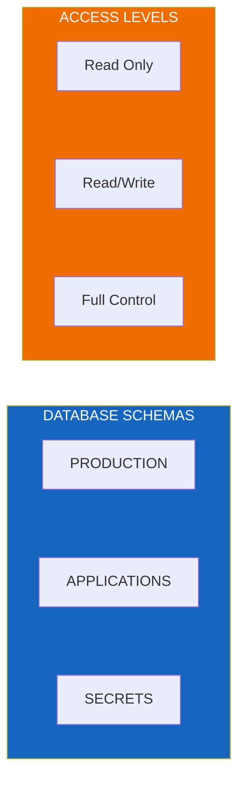

# Security Model

Role-based access control (RBAC) and security configuration for Flux Utility Solutions.

---

## Role Hierarchy



---

## Role Definitions

| Role | Purpose | Typical Users |
|------|---------|---------------|
| **FLUX_ADMIN** | Full ownership of all objects | Platform administrators |
| **FLUX_USER** | Read access to analytics | Business analysts, data scientists |
| **FLUX_ETL** | Data modification for pipelines | ETL processes, data engineers |
| **FLUX_SERVICE** | SPCS and service accounts | Applications, automated processes |
| **FLUX_ANALYST** | Cortex Analyst access | Business users with NL-SQL needs |

---

## Permission Matrix

| Role | Database | Warehouse | Semantic Views | Search | Agents |
|------|----------|-----------|----------------|--------|--------|
| **Admin** | OWNERSHIP | OPERATE | ALL | ALL | ALL |
| **User** | USAGE | USAGE | SELECT | QUERY | USAGE |
| **Analyst** | USAGE | USAGE | SELECT | QUERY | - |
| **ETL** | MODIFY | USAGE | - | - | - |
| **Service** | USAGE | USAGE | - | - | USAGE |

---

## Schema-Level Permissions



| Schema | Admin | User | ETL | Service | Analyst |
|--------|-------|------|-----|---------|---------|
| **PRODUCTION** | OWNERSHIP | SELECT | MODIFY | SELECT | SELECT |
| **APPLICATIONS** | OWNERSHIP | USAGE | - | USAGE | USAGE |
| **SECRETS** | OWNERSHIP | - | - | SELECT | - |

---

## Role Creation Scripts

### Admin Role

```sql
CREATE ROLE IF NOT EXISTS FLUX_ADMIN;
GRANT OWNERSHIP ON DATABASE FLUX_UTILITY_SOLUTIONS TO ROLE FLUX_ADMIN;
GRANT OPERATE ON WAREHOUSE FLUX_WH TO ROLE FLUX_ADMIN;
```

### User Role

```sql
CREATE ROLE IF NOT EXISTS FLUX_USER;
GRANT USAGE ON DATABASE FLUX_UTILITY_SOLUTIONS TO ROLE FLUX_USER;
GRANT USAGE ON WAREHOUSE FLUX_WH TO ROLE FLUX_USER;
GRANT SELECT ON ALL TABLES IN SCHEMA PRODUCTION TO ROLE FLUX_USER;
```

### Analyst Role

```sql
CREATE ROLE IF NOT EXISTS FLUX_ANALYST;
GRANT ROLE FLUX_USER TO ROLE FLUX_ANALYST;
GRANT USAGE ON SEMANTIC VIEW flux_semantic_view TO ROLE FLUX_ANALYST;
GRANT USAGE ON CORTEX SEARCH SERVICE customer_search TO ROLE FLUX_ANALYST;
```

### ETL Role

```sql
CREATE ROLE IF NOT EXISTS FLUX_ETL;
GRANT USAGE ON DATABASE FLUX_UTILITY_SOLUTIONS TO ROLE FLUX_ETL;
GRANT USAGE ON WAREHOUSE FLUX_WH TO ROLE FLUX_ETL;
GRANT INSERT, UPDATE, DELETE ON ALL TABLES IN SCHEMA PRODUCTION TO ROLE FLUX_ETL;
```

### Service Role

```sql
CREATE ROLE IF NOT EXISTS FLUX_SERVICE;
GRANT USAGE ON DATABASE FLUX_UTILITY_SOLUTIONS TO ROLE FLUX_SERVICE;
GRANT USAGE ON WAREHOUSE FLUX_WH TO ROLE FLUX_SERVICE;
GRANT USAGE ON COMPUTE POOL flux_compute_pool TO ROLE FLUX_SERVICE;
```

---

## Best Practices

### Principle of Least Privilege

- Grant minimum permissions needed for each role
- Use role hierarchy to inherit common permissions
- Review and audit permissions regularly

### Secrets Management

- Store API keys in SECRETS schema
- Limit SECRETS access to Admin and Service roles
- Rotate credentials periodically

### Audit Logging

```sql
-- Query access history
SELECT *
FROM SNOWFLAKE.ACCOUNT_USAGE.ACCESS_HISTORY
WHERE query_start_time > DATEADD(day, -7, CURRENT_TIMESTAMP())
  AND direct_objects_accessed LIKE '%FLUX%';
```

---

## Service Account Setup

For automated processes and SPCS:

```sql
-- Create service user
CREATE USER IF NOT EXISTS flux_service_user
  DEFAULT_ROLE = FLUX_SERVICE
  DEFAULT_WAREHOUSE = FLUX_WH;

-- Grant role
GRANT ROLE FLUX_SERVICE TO USER flux_service_user;
```

---

## Network Policies (Optional)

For enterprise environments with IP restrictions:

```sql
CREATE NETWORK POLICY IF NOT EXISTS flux_network_policy
  ALLOWED_IP_LIST = ('10.0.0.0/8', '192.168.0.0/16')
  BLOCKED_IP_LIST = ();

ALTER ACCOUNT SET NETWORK_POLICY = flux_network_policy;
```

See [DEPLOYMENT.md](./DEPLOYMENT.md) for complete security setup instructions.
