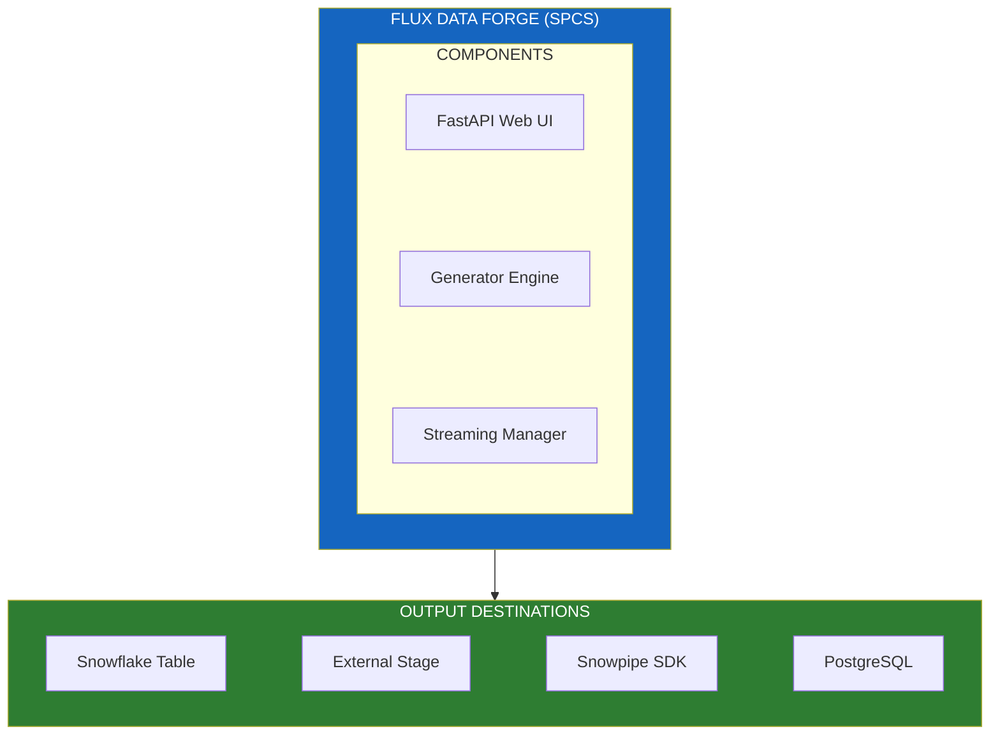

# Flux Data Forge - SPCS Application

> **Two Applications in One**: Synthetic data generation + Real-time streaming pipelines demo

## Overview

Flux Data Forge is an SPCS (Snowpark Container Services) application that serves two purposes:

1. **Synthetic Data Generator**: Creates realistic utility grid data (up to 350M+ rows)
2. **Pipelines Streaming Demo**: Demonstrates 4 different data ingestion patterns with varying latency characteristics

This enables demos showcasing Snowflake's real-time streaming capabilities.

## Key Capabilities

### Data Generation Presets

| Preset | Meters | Time Range | Est. Rows | Use Case |
|--------|--------|------------|-----------|----------|
| Quick Demo | 100 | 7 days | ~67K | Fast 5-minute generation |
| SE Demo | 1,000 | 90 days | ~8.6M | Standard Cortex Analyst demos |
| Enterprise POC | 5,000 | 180 days | ~86M | Customer POC evaluations |
| ML Training | 10,000 | 365 days | ~350M | Model training datasets |

### Pipeline Streaming Modes

| Mode | Latency | Description |
|------|---------|-------------|
| **Snowflake Task** | ~1 min | Scheduled task generates data every minute |
| **Snowpipe Streaming SDK** | <5 sec | Real-time streaming inserts to Snowflake |
| **Stage Landing** | ~5-10 sec | External Stage → Snowpipe auto-ingest → Bronze table (medallion architecture) |
| **Dual Write** | Full stack | Simultaneous Snowflake + PostgreSQL for analytics + operations |

### Emission Patterns

| Pattern | Description |
|---------|-------------|
| Uniform | All meters report at each interval (max throughput testing) |
| Staggered Realistic | Meters report across 15-min window (mimics real AMI) |
| Partial (98%) | 2% communication failures (realistic data quality) |
| Degraded (85%) | Network issues or storm conditions simulation |

## Architecture



## Prerequisites

1. **Compute Pool**: `FLUX_DATA_FORGE_POOL` (CPU_X64_S, 1-2 nodes)
2. **Image Repository**: For storing Docker images
3. **External Access Integrations**:
   - `FLUX_POSTGRES_INTEGRATION` - PostgreSQL connectivity
   - `AWS_S3_EAI` - S3 external stage access
4. **Secrets**:
   - `AMI_STREAMING_KEY` - RSA private key for Snowpipe Streaming SDK
   - `POSTGRES_CREDENTIALS` - PostgreSQL password
   - `AWS_S3_CREDENTIALS` - AWS access keys (if using S3)
5. **Service User**: `AMI_STREAMING_USER` with RSA public key

## Deployment

### 1. Build and Push Docker Image

```bash
cd spcs/flux_data_forge
./build_and_push.sh
```

**Critical**: SPCS only supports `linux/amd64` architecture. On Apple Silicon:
```bash
docker build --platform linux/amd64 -t flux-data-forge:latest .
```

### 2. Upload Service Spec

```bash
snow stage copy service_spec.yaml @{{ database }}.{{ schema }}.DEPLOYMENT_STAGE \
  --overwrite --connection {{ connection }}
```

### 3. Create Service

```sql
CREATE SERVICE {{ database }}.{{ schema }}.FLUX_DATA_FORGE_SERVICE
  IN COMPUTE POOL FLUX_DATA_FORGE_POOL
  FROM @{{ database }}.{{ schema }}.DEPLOYMENT_STAGE
  SPECIFICATION_FILE = 'service_spec.yaml'
  EXTERNAL_ACCESS_INTEGRATIONS = (FLUX_POSTGRES_INTEGRATION, AWS_S3_EAI)
  MIN_INSTANCES = 1
  MAX_INSTANCES = 1
  QUERY_WAREHOUSE = {{ warehouse }};
```

### 4. Grant Access

```sql
GRANT USAGE ON SERVICE {{ database }}.{{ schema }}.FLUX_DATA_FORGE_SERVICE 
  TO ROLE PUBLIC;
```

### 5. Get Endpoint URL

```sql
SHOW ENDPOINTS IN SERVICE {{ database }}.{{ schema }}.FLUX_DATA_FORGE_SERVICE;
```

## Configuration

### Environment Variables (service_spec.yaml)

| Variable | Description |
|----------|-------------|
| `SNOWFLAKE_ACCOUNT` | Snowflake account identifier |
| `SNOWFLAKE_USER` | Service user for key pair auth |
| `SNOWFLAKE_DATABASE` | Target database |
| `SNOWFLAKE_SCHEMA` | Target schema |
| `SNOWFLAKE_WAREHOUSE` | Warehouse for queries |
| `POSTGRES_HOST` | Managed PostgreSQL hostname |
| `POSTGRES_DATABASE` | PostgreSQL database |
| `POSTGRES_USER` | PostgreSQL user |
| `AWS_REGION` | AWS region for S3 stages |
| `AWS_ROLE_ARN` | IAM role for S3 access |

### Secrets Mount

```yaml
secrets:
  - snowflakeSecret: AMI_STREAMING_KEY
    directoryPath: '/usr/local/creds'           # RSA key file
  - snowflakeSecret: POSTGRES_CREDENTIALS
    secretKeyRef: password
    envVarName: POSTGRES_PASSWORD
  - snowflakeSecret: AWS_S3_CREDENTIALS
    secretKeyRef: username
    envVarName: AWS_ACCESS_KEY_ID
```

## Data Sources

Flux Data Forge can generate data using:

| Source | Description | Row Count |
|--------|-------------|-----------|
| `METER_INFRASTRUCTURE` | Real CenterPoint meter assignments | 596,906 |
| `AMI_METADATA_SEARCH` | Searchable AMI metadata | 596,906 |
| `SYNTHETIC` | Generated meter IDs (no production data) | Unlimited |

## Demo Scenarios

### Scenario 1: Snowpipe Streaming SDK Demo
Demonstrates sub-5-second latency streaming to Snowflake tables.

```
1. Select "Snowflake Table (Real-time)" mode
2. Choose meter count (1K-100K)
3. Start streaming
4. Query table to see data arriving in <5 seconds
```

### Scenario 2: Medallion Architecture Demo
Shows External Stage → Snowpipe → Bronze → Silver → Gold pattern.

```
1. Select "Stage Landing (Raw JSON)" mode
2. Configure S3 external stage
3. Start streaming
4. Watch data flow through bronze/silver/gold tables
```

### Scenario 3: Dual Write (Analytics + Operations)
Competitive feature vs Palantir - simultaneous analytics and operational databases.

```
1. Select "Dual Write (SF + Postgres)" mode
2. Start streaming
3. Show Snowflake for analytics queries
4. Show PostgreSQL for <20ms operational lookups
```

## Troubleshooting

### Check Service Status
```bash
snow sql -q "SELECT SYSTEM\$GET_SERVICE_STATUS('FLUX_DATA_FORGE_SERVICE')"
```

### View Logs
```sql
SELECT SYSTEM$GET_SERVICE_LOGS('FLUX_DATA_FORGE_SERVICE', 'flux-data-forge', 0, 100);
```

### Common Issues

| Error | Cause | Fix |
|-------|-------|-----|
| `amd64 architecture` | Built on ARM | Add `--platform linux/amd64` |
| `Image not updating` | SPCS caches images | DROP and CREATE service |
| `ConfigError: No user` | Missing RSA key | Check AMI_STREAMING_KEY secret |

## Competitive Context

| Feature | Palantir Grid 360 | Snowflake Flux |
|---------|-------------------|----------------|
| Streaming Latency | ~1 minute | <5 seconds |
| Dual Database | Yes | Yes (SF + Postgres) |
| Scale | Unknown | 350M+ rows demo |
| Architecture | Proprietary | Open (SPCS) |

**GAP 2 (Real-Time Streaming Infrastructure) from FDE Assessment: RESOLVED**

## Files

| File | Purpose |
|------|---------|
| `src/app.py` | Main FastAPI application (13K lines) |
| `service_spec.yaml` | SPCS service specification |
| `Dockerfile` | Container image definition |
| `requirements.txt` | Python dependencies |
| `build_and_push.sh` | Build and push Docker image |
| `deploy_spcs.sql` | SQL deployment script |

## Related Components

- [Flux Ops Center](../flux_ops_center/) - Consumes streaming data for visualization
- [PostgreSQL Sync Pipeline](../../scripts/24_postgres_sync_pipeline.sql) - CDC sync to PostgreSQL
- [Cortex Analyst](../../models/utility_semantic_model.yaml) - Semantic layer over generated data
